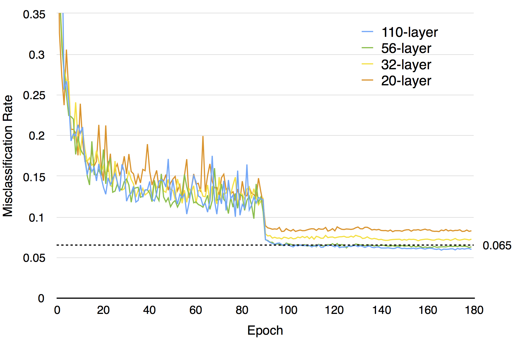

# Model
This is an implementation of the deep residual network used for cifar10 as described in [He et. al.,
"Deep Residual Learning for Image Recognition"](http://arxiv.org/abs/1512.03385).  The model is
structured as a very deep network with skip connections designed to have convolutional parameters
adjusting to residual activations.  The training protocol uses minimal pre-processing (mean
subtraction) and very simple data augmentation (shuffling, flipping, and cropping).  All model
parameters (even batch norm parameters) are updated using simple stochastic gradient descent with
weight decay.  The learning rate is dropped only twice (at 90 and 135 epochs).  Many thanks to Dr.
He and his team at MSRA for their helpful input in replicating the model as described in their
paper.

### Model script
The model train script is included ([cifar10_msra.py](./cifar10_msra.py)).

### Trained weights
The trained weights file can be downloaded from AWS ([cifar10_msra_e180.p](https://s3-us-west-1.amazonaws.com/nervana-modelzoo/cifar10_msra_e180.p))

### Performance
Training this model with the options described below should be able to achieve above 93.5% top-1
error using only mean subtraction, random cropping, and random flips.  This is roughly the same
performance achieved in the paper with the 56-layer network.

## Instructions
This script was tested with [neon version 1.2](https://github.com/NervanaSystems/neon/tree/v1.2.0).
Make sure that your local repo is synced to this commit and run the [installation
procedure](http://neon.nervanasys.com/docs/latest/user_guide.html#installation) before proceeding.
Commit SHA for v1.2 is  `385483881ee1fe1f0445fc78d7edf5b8ddc5c8c5`

This example uses the `ImageLoader` module to load the images for consumption while applying random
cropping, flipping, and shuffling.  Prior to beginning training, you need to write out the padded
cifar10 images into a macrobatch repository.  From your top-level neon direcotry, run:

```
neon/data/batch_writer.py \
    --set_type cifar10 \
    --data_dir <path-to-save-batches> \
    --macro_size 10000 \
    --target_size 40
```

Note that it is good practice to choose your `data_dir` to be local to your machine in order to
avoid having `ImageLoader` module perform reads over the network.

Once the batches have been written out, you may initiate training:
```
cifar10_msra.py -r 0 -vv \
    --log <logfile> \
    --epochs 180 \
    --save_path <model-save-path> \
    --eval_freq 1 \
    --backend gpu \
    --data_dir <path-to-saved-batches>
```

If you just want to run evaluation, you can use the much simpler script that loads the serialized
model and evaluates it on the validation set:

```
cifar10_eval.py -vv --model_file <model-save-path>
```

## Benchmarks
Machine and GPU specs:
```
Intel(R) Core(TM) i7-4790 CPU @ 3.60GHz
Ubuntu 14.04.2 LTS
GPU: GeForce GTX TITAN X
CUDA Driver Version 7.0
```
The default 56 layer configuration occupies approximately 860 Mb of gpu memory, with each epoch
taking approximately 30 seconds.  The entire training procedure should take about 90 minutes to
complete all 180 epochs.  The evolution of validation misclassification error can be seen in the
figure below. 
